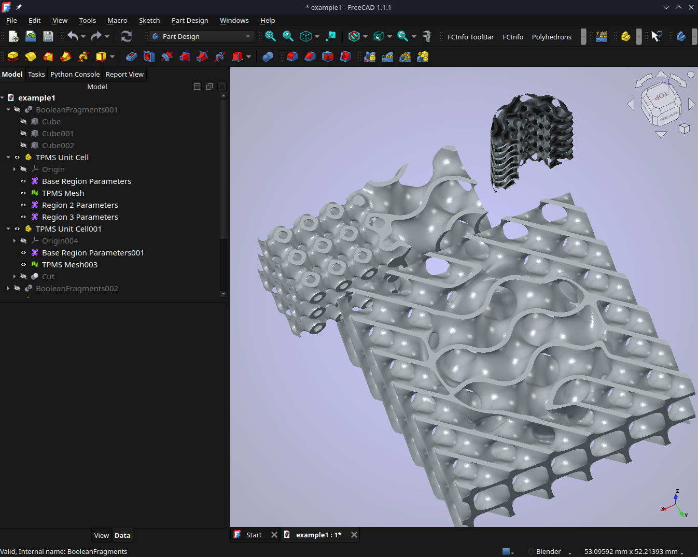

# TPMS Generator

FreeCAD workbench for generating TPMS meshes from implicit equations.  The
workbench creates parametric TPMS controller objects in the model tree, so the
mesh can be refreshed after changing the boundary, resolution, equation,
grading, or coordinate mode.



## Features

- Generate sheet, skeletal, upper, lower, or zero-surface TPMS meshes.
- Use preset equations such as Gyroid and Schwarz P, or enter a custom implicit
  equation.
- Clip TPMS directly to selected FreeCAD solids without a separate mesh boolean.
- Use analytical boundaries for supported Part boxes, spheres, cylinders, and
  tubes.
- Generate cylindrical-coordinate TPMS rings with seamless angular wrapping.
- Add capped or uncapped meshes.
- Apply uniform or non-uniform unit-cell density and offset/thickness grading.
- Use selected-face distance fields or harmonic fields for grading.
- Split BooleanFragments into regions and assign per-region TPMS settings.
- Blend two TPMS equations through an explicit transition region.

## Installation

Clone or copy this folder into the FreeCAD user `Mod` directory:

```bash
~/.local/share/FreeCAD/v1-1/Mod/gyroid_assembler
```

Restart FreeCAD and select the `TPMS Generator` workbench.

## Basic Workflow

1. Create or import a solid boundary in FreeCAD.
2. Switch to the `TPMS Generator` workbench.
3. Click `Create TPMS Unit Cell`.
4. Select the generated `Base Region Parameters` object in the tree.
5. Set `Boundary Mode` to `Selected solid` and choose the boundary object.
6. Adjust the equation, part type, resolution, cell size, sheet/skeletal
   thickness, and capping options.
7. Click `Refresh TPMS` or recompute the document.

Double-click a TPMS parameter object in the tree to reopen its task panel.

## Boolean Fragment Regions

For a `BooleanFragments` object with multiple solid regions:

1. Use the fragment object as the selected boundary.
2. Click `Add TPMS Settings For All Regions`.
3. Edit each region parameter object as needed.
4. Mark an intermediate region as a transition region when blending two
   different TPMS equations.

Transitions are explicit: shared faces between two regions do not blend by
themselves.  A separate transition region must be assigned source and target
regions.

### Transition Blend Modes

Transition regions support two blend modes:

- `Offset Surface Interpolation`: blends the valid TPMS material interval for
  each part type.  For example, a sheet is treated as the interval around the
  TPMS zero surface, while upper and lower skeletal parts are treated as
  one-sided intervals.  This is the safer choice for transitions between sheet
  and skeletal TPMS because it avoids field cancellation that can create torn or
  abrupt-looking meshes.
- `Morphological signed-field blend`: blends the signed implicit material
  fields directly.  This matches the common form `F_hybrid = w * F_target +
  (1 - w) * F_source`.  It is useful for compatible solid fields, empty/solid
  transitions, or similar structures.  For sheet-to-skeletal transitions,
  direct signed-field blending can cancel near the midpoint of the transition,
  which may create torn or abrupt-looking meshes.  In that case, choose
  `Offset Surface Interpolation` explicitly.

## Cylindrical Rings

Set `Coordinate Mode` to `Cylindrical ring` to generate TPMS in cylindrical
coordinates.  With `Origin Mode` set to `Boundary object`, the ring center
follows the selected boundary object's placement.  Tube boundaries can be used
to clip the ring directly.

## Tests

Run the headless workflow test from this folder:

```bash
python3 -m py_compile tpms_generator.py objects/TPMSUnitCell.py ui/task_tpms.py tests/boolean_fragment_region_workflow.py
FreeCADCmd -c "import runpy; runpy.run_path('tests/boolean_fragment_region_workflow.py', run_name='__main__')"
```

The workflow test checks BooleanFragments region handling, transition-region
generation, cylindrical ring origin handling, and basic mesh validity.

## Notes

- Higher mesh resolution increases generation time and memory use quickly.
- Mesh relaxation is optional and off by default for predictable boundaries.
- Capping is on by default so generated sheet and skeletal meshes can be closed
  against the selected boundary.
- Sheet thickness is symmetric around the TPMS mid-surface.  A sheet thickness
  of `t` generates material between approximately `F = -t/2` and `F = +t/2`,
  so both labyrinth sides are offset equally before boundary clipping and
  grading are applied.
- `example/example1.FCStd` and `example/screenshot.png` show a multi-region TPMS
  setup in FreeCAD.

## License
GPL-3.0 license
